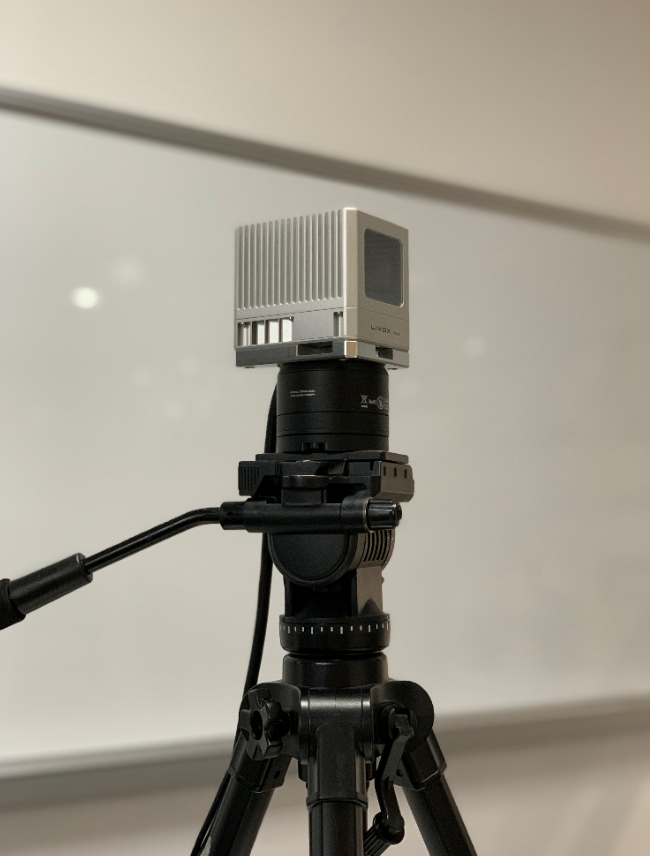
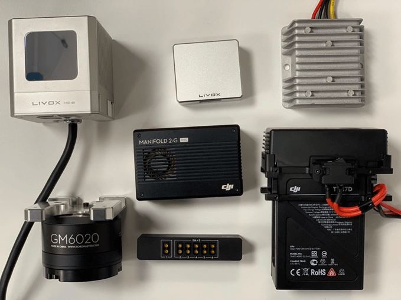
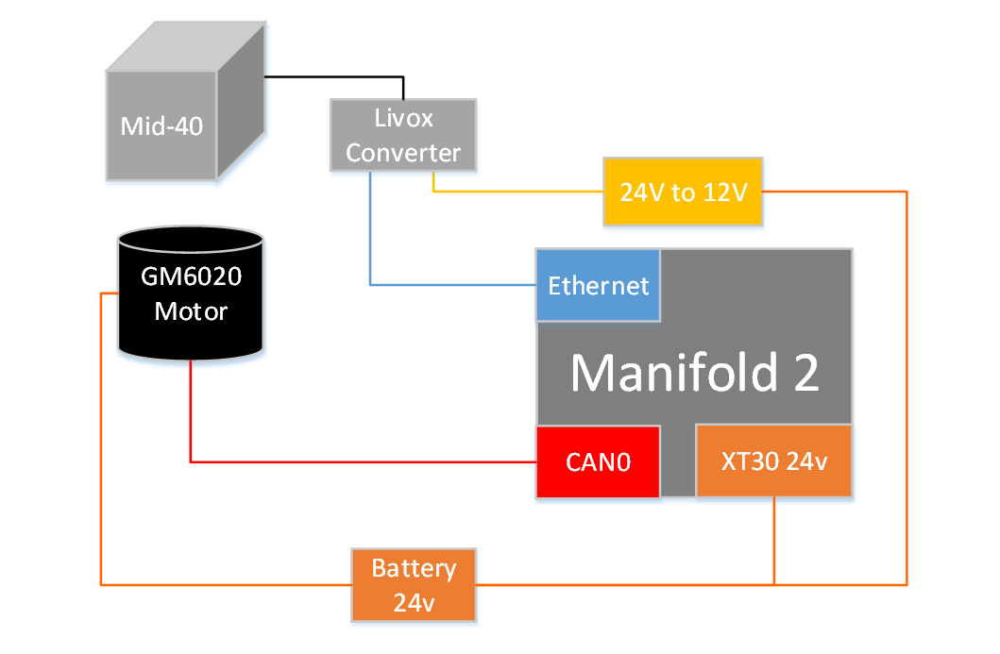
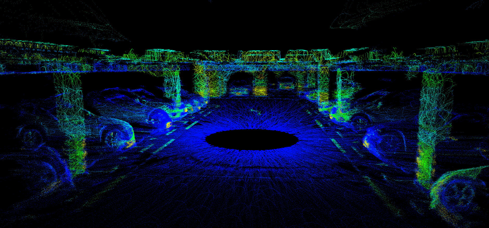
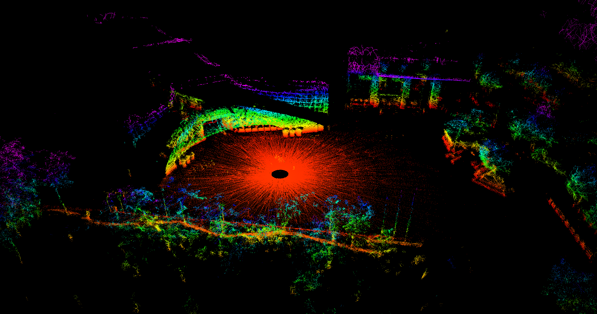

[中文文档](doc/cn/README.md)

## 1.System overview
The 3D scanning solution mainly consists of a MID-40, a DJI Manifold 2, and a GM6020 motor with an encoder. The LiDAR and the motor are mounted on top of a tripod and the MID-40 rotates around the z axis to scan different parts of the room. The point cloud data is then integrated to give an overall 3D image.



## 2.Hardware modules

First of all, you need to prepare the following hardware modules. The remarks have descriptions and links of related products.

| Name          | Nums | Remarks                                                      |
| ------------- | ---- | ------------------------------------------------------------ |
| Mid-40        | 1    | [Mid-40](https://www.livoxtech.com/cn/mid-40-and-mid-100)    |
| GM6020        | 1    | Brushless DC motor,[GM6020](https://www.robomaster.com/en-US/products/components/general/gm6020/info) |
| Manifold 2    | 1    | NVIDIA Jetson TX2 core,[Manifold 2-G](https://www.dji.com/cn/manifold-2) |
| DC-DC Buck module | 1    | 24V-12V,[DC-DC](https://detail.tmall.com/item.htm?spm=a1z10.5-b-s.w4011-22634399823.63.3980567e8iHRQI&id=565654736873&rn=8370e15b14a401cd4e0b38e81231519f&abbucket=11) |

Main components of this setup are shown in the follow figure.



## 3.Hardware connection

1、Use [Livox Viewer]( https://www.livoxtech.com/downloads ) to configure Mid-40 to static IP mode;

2、The ethernet of Livox Converter: connect to Manifold 2;

3、The power interface of Livox Converter: connect to DC-DC 12V power;

4、GM6020 CAN interface: connect to the CAN0 interface of manifold2, the CAN_L and CAN_H pins of the ports on both sides need to correspond;

5、GM6020 power interface: connect to 24V DC power;

<div align=center></div>

*Remarks:*
- Motor angle accuracy. GM6020 angle accuracy: 360/8192 ≈ 0.04.
- Motor control. Using a PID controller to keep the motor at a constant rotation speed during scanning.

## 4.Software

### Install PCL, Eigen dependencies

- [PCL](https://pointclouds.org/downloads/#linux)
- [Eigen](http://eigen.tuxfamily.org/index.php?title=Main_Page)

### Install livox_scanner
```
cd ws_livox/src
git clone https://github.com/Livox-SDK/livox_scanner.git
# build
cd ../
catkin_make
source ./devel/setup.bash
```

### Software Configuration

Communication with the motor uses CAN0 interface of Manifold 2, Root and run [can_config.sh](./scanner_publisher/can_config.sh)：

```
sudo ./can_config.sh
```

### Run

```
roslaunch scanner_publisher scanner.launch
```

## 5.Result

### Garage scene

The real-time result:

<div align=center></div>
The finished result:

<div align=center></div>

### Square scene

The real-time result:

<div align=center></div>
The finished result:

<div align=center></div>