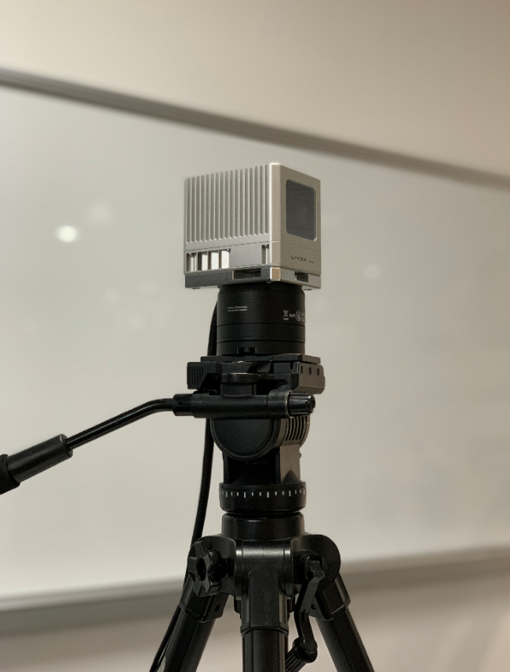
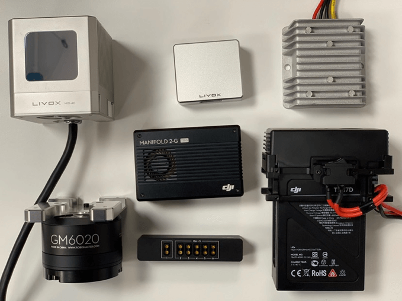
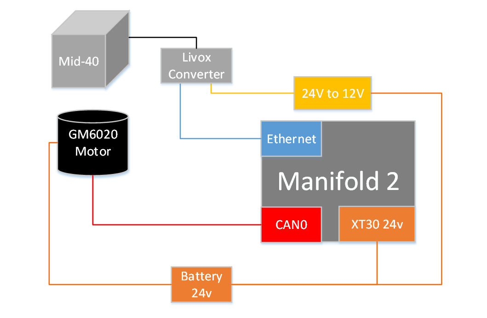
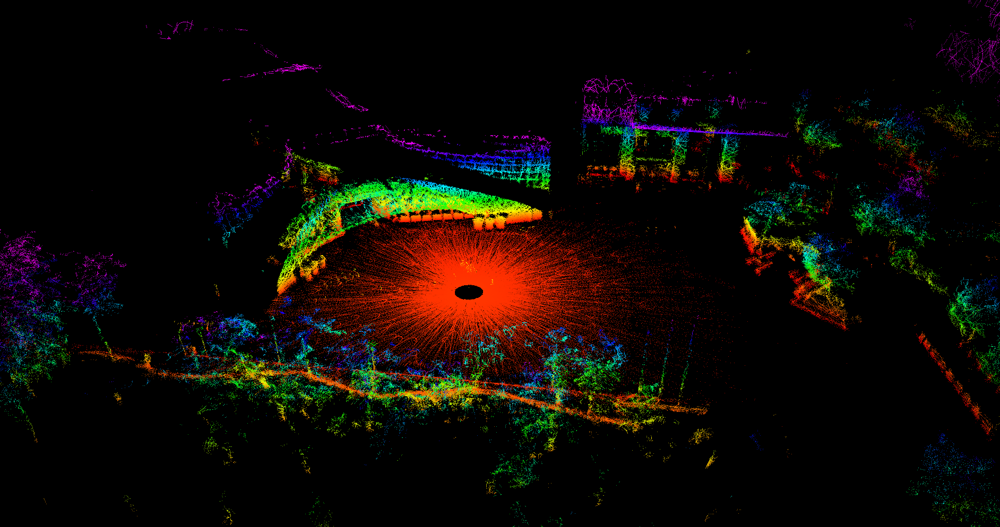
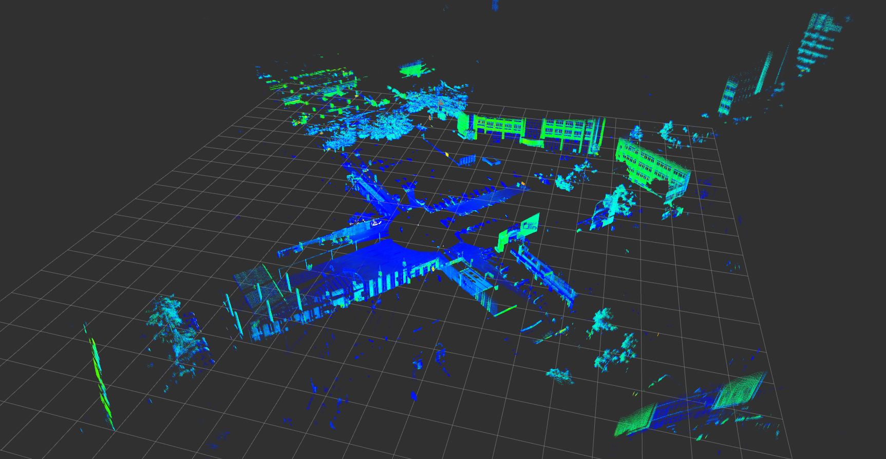
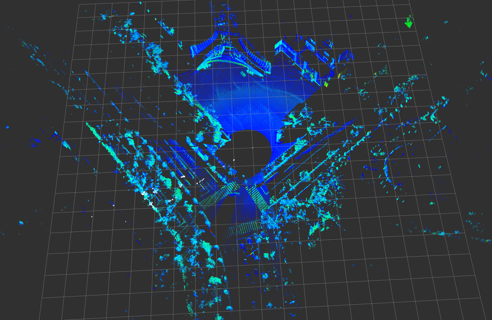
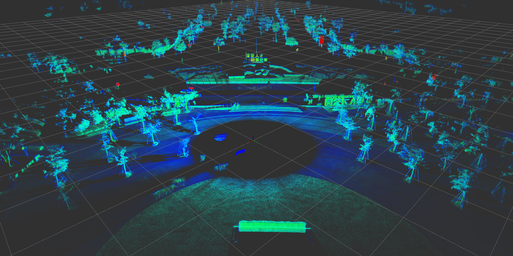
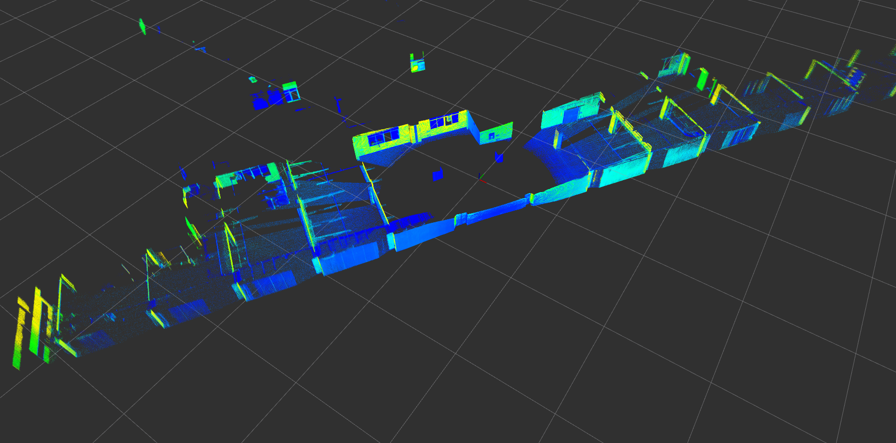

[English document](../../README.md)

## 1.方案概述
这个3D扫描解决方案主要包括一个Mid-40激光雷达、Manifold 2计算平台，以及一个带编码器的GM6020电机。LiDAR和电机安装在三脚架顶端，Mid-40将绕Z轴旋转，扫描空间内不同区域，点云数据融合电机角度后得到空间中的3维图像。

<div align="center"></div>

## 2.硬件列表

为了实现上述的功能，需要准备如下的几个硬件模块。

| 名称          | 数量 | 备注                                                         |
| ------------- | ---- | ------------------------------------------------------------ |
| Mid-40        | 1    | [Mid-40](https://www.livoxtech.com/cn/mid-40-and-mid-100)    |
| GM6020        | 1    | 直流无刷电机，[GM6020](https://www.robomaster.com/en-US/products/components/general/gm6020/info) |
| Manifold 2    | 1    | NVIDIA Jetson TX2核心，[Manifold 2-G](https://www.dji.com/cn/manifold-2) |
| DC-DC降压模块 | 1    | 24V转12V，[DC-DC](https://detail.tmall.com/item.htm?spm=a1z10.5-b-s.w4011-22634399823.63.3980567e8iHRQI&id=565654736873&rn=8370e15b14a401cd4e0b38e81231519f&abbucket=11) |

下图显示了此设置的主要组件。

<div align="center"></div>

## 3.硬件连接

1、在PC上使用[Livox Viewer]( https://www.livoxtech.com/downloads )将Mid-40配置为静态IP模式；

2、Livox转接盒的网口：通过网线直连至Manifold 2的以太网接口；

3、Livox转接盒的供电接口：接入DC-DC降压模块输出的12V电源；

4、GM6020 CAN接口：连接到manifold2的CAN0接口上，两边端口的CAN_L和CAN_H引脚需要对应；

5、GM6020 电源接口：接入24V直流电源；

<div align="center"></div>

*备注：*
- 电机角度精度，GM6020电机的角度分辨率为 360/8192 ≈ 0.04 度。
- 电机控制，通过电机编码器反馈的转速，使用PID控制器调节，使电机在扫描期间保持恒定的旋转速度。

## 4.软件使用

### 安装 PCL, Eigen 依赖

- [PCL](https://pointclouds.org/downloads/#linux)
- [Eigen](http://eigen.tuxfamily.org/index.php?title=Main_Page)

### 安装 livox_scanner

进入到ROS工作目录的src中，如catkin_make/src

```
# clone工程
git clone https://github.com/Livox-SDK/livox_scanner.git
# 编译
cd ../
catkin make
source ./devel/setup.bash
```

### 配置

和电机通信使用了manifold2的CAN0接口，使用root权限运行[can_config.sh](./scanner_publisher/can_config.sh)脚本，配置系统中的CAN0接口：

```
sudo ./can_config.sh
```

### 运行

```
roslaunch scanner_publisher scanner.launch
```

## 5.效果

动态效果：

<div align="center"></div>

建图完成后的效果：

<div align="center"></div>

## 6.使用览沃-泰览（Tele-15）激光雷达

### 说明

泰览Tele-15激光雷达具有测量距离远、探测精度高的特点，旋转后可获得空间大范围建图效果。

*备注：*
- 泰览Tele-15激光雷达配备Livox转接盒2.0，可直接接入24V直流电源，无需再使用DC-DC降压模块。

### 效果

<div align="center"></div>

<div align="center"></div>

<div align="center"></div>

<div align="center"></div>

动态效果：

<div align="center"></div>